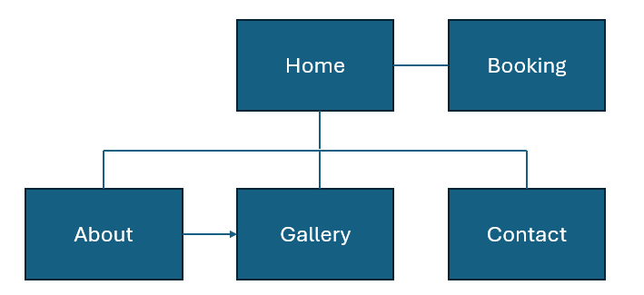
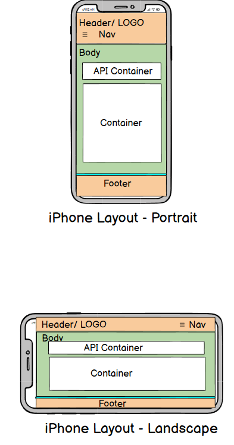
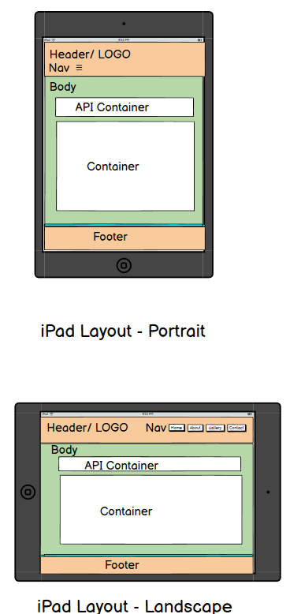
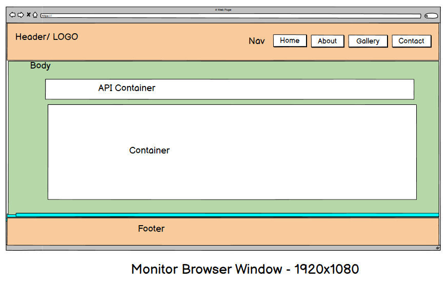
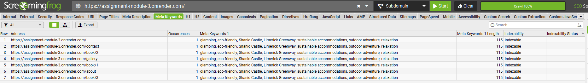
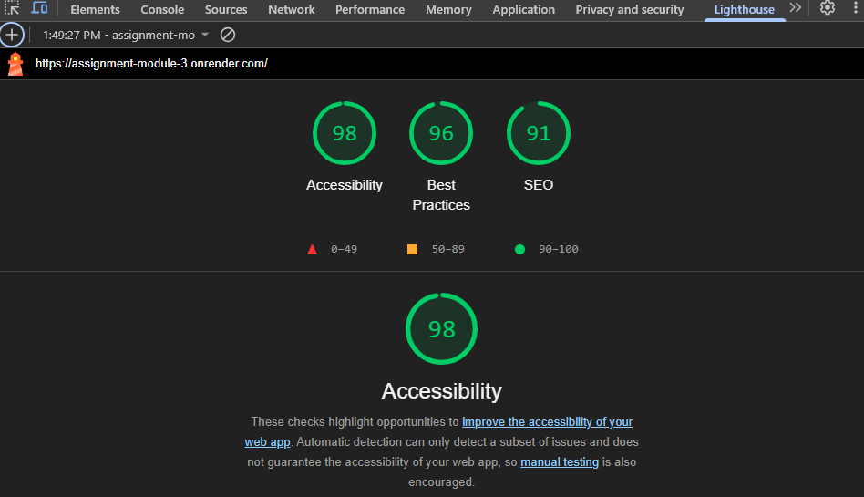
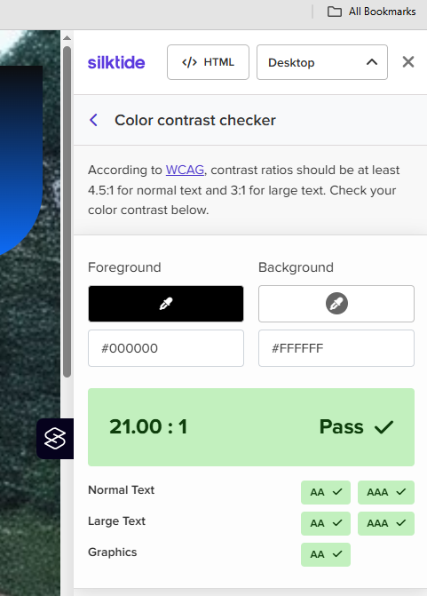

## Submission readme.md file
Github-pages: URL:
    https://aruttle.github.io/assignment_module2/

Github-repo: URL:
    https://github.com/aruttle/assignment_module2
    https://github.com/aruttle/assignment-module-2

## Site Map

---
[Link to view the image](./docs/site-map-flow.png)

### Site Map Address 
    https://aruttle.github.io/assignment_module2/
    https://aruttle.github.io/assignment_module2/knot-guide.html
    https://aruttle.github.io/assignment_module2/knot-quiz.html

### Site Map XML
   <?xml version="1.0" encoding="utf-8"?><!--Generated by Screaming Frog SEO Spider 21.1-->
<urlset xmlns="http://www.sitemaps.org/schemas/sitemap/0.9">
  <url>
    <loc>https://aruttle.github.io/assignment_module2/</loc>
    <lastmod>2025-02-22</lastmod>
    <changefreq>daily</changefreq>
    <priority>1.0</priority>
  </url>
  <url>
    <loc>https://aruttle.github.io/assignment_module2/knot-guide.html</loc>
    <lastmod>2025-02-22</lastmod>
    <changefreq>daily</changefreq>
    <priority>0.9</priority>
  </url>
  <url>
    <loc>https://aruttle.github.io/assignment_module2/knot-quiz.html</loc>
    <lastmod>2025-02-22</lastmod>
    <changefreq>daily</changefreq>
    <priority>0.9</priority>
  </url>
  <url>
    <loc>https://aruttle.github.io/assignment_module2/index.html</loc>
    <lastmod>2025-02-22</lastmod>
    <changefreq>daily</changefreq>
    <priority>0.8</priority>
  </url>
</urlset>

</urlset>

## Wireframes
Click [here](./docs/wireframes.pdf)

[Link to view the image](./docs/iphone-wireframe.png)

[Link to view the image](./docs/ipad-wireframe.png)

[Link to view the image](./docs/monitor-wireframe.png)

## Planning Analysis Sheet
### Website goal
    
The goal of this website is to provide a simple, responsive platform for a (fictional) glamping business located near the Shannon Estuary. Visitors can explore available accommodations, view photos of the site, and make bookings through an intuitive interface. The site is built using Flask and follows the courses modern web design principles to ensure accessibility, interactivity, and ease of use on both desktop and mobile devices.

## Features

**Interactive Booking System** – Users can view available accommodations and make bookings directly through the site.

**Responsive Design** – Optimized using bootstrapping for seamless viewing and interaction across mobile, tablet, and desktop devices.

**Dynamic Content** – Pages like Gallery and About are easily updatable and render content dynamically.

**Easy to Navigate UI** – Built using a consistent and easy-to-navigate layout.

**Flask Backend** – Lightweight and efficient Python framework for routing and handling form submissions.

**Templating** – Reduces repetition with reusable HTML components and template inheritance.

**Local JSON Data Handling** – Stores and retrieves booking data using JSON for simplicity and portability.

## How to Use

### **Accommodation Browser**
Browse a list of glamping accommodations.

Each listing includes a name, description, and image.

Click the "Book Now" button to begin the booking process for your selected accommodation.

### **Booking System**
Fill out a simple form with your name, check-in and check-out dates.

Once submitted, a booking confirmation appears with all your details.

Dates are validated to prevent booking overlaps.

Your booking is saved and viewable for confirmation purposes.

### **Gallery**
Explore images of the glamping site and surrounding landscape.

Great for getting a feel for the experience before you book.

### **About Page**
Learn about the fictional story behind the site and why it was created and what makes it unique.

Includes a brief look at the location, values, and eco-friendly focus.

### **Contact Page**
A contact form allows users to reach out with inquiries or special requests.

Simple and clean form with name, email, and message fields.

# Working Page Titles and Goals

## Home
**Goal:** Welcome users to the site and highlight the charm of glamping near the Shannon Estuary. Provides an overview of offerings and encourages users to explore accommodations.

## Booking
**Goal:** Enable users to select their preferred dates and accommodation. It provides a streamlined booking form with real-time validation and user-friendly feedback.

## Gallery
**Goal:** Visually showcase the glamping experience, highlighting natural beauty and unique setups.

## About
**Goal:** Introduce the purpose behind the business and the benefits of this specific location. Builds trust and a sense of connection.

## Contact
**Goal:** Provide an easy way for users to reach out for questions, requests, or feedback.

## List of sources
### Images
   Images of pods:
   https://app.klingai.com/

   All other images are my own

### API
    The API used is from: 
    https://api.open-meteo.com/

### Other Websites
    MDN:
    https://developer.mozilla.org/en-US/docs/Web
    Swiper:
    https://swiperjs.com/

### Logo
    The logo was created in PowerPoint from own image.

## SEO Features
    I used meta-keywords and sitemap.xml

[Link to view the image](./docs/meta-keywords.png)

## Accessibility
   To check the accessability of the site I used a combination of Lighthouse and  Silktide. All scored high

[Link to view the image](./docs/lighthouse.png)

[Link to view the image](./docs/silktide.png)

## Site Features 
- Responsive at max-width: 1024px and max-width: 768px.
- Works in browsers Chrome, Edge and Firefox.
- The colour palette used for the visual design was in keeping with the background image sunset.
- The Navigation bar is consistent across all pages.
- The Banner is also consistent across all pages.
- Site has a Home Page and 2 content pages.
- Meta Tags used as outlined above.
- YouTube videos embedded.
- CSS Transition also added to hyperlinks and nav buttons.
- Bootstrap implemented
- API implemented 

## Future Enhancements
With more time, I would have liked to incorporate the following:
- Allow users to input their location for personalized weather updates.
- Add more knots and quizzes to enhance the content.
- Improve error handling in case of API failures.
- Provide users with the option to save and track their quiz scores over time.
 

## Challenges
During the development I came across many coding challenges, using MDN, our college notes and some AI queries I was able to solve most, some examples: 
    Images used were being cropped so I found a line of css to fix this: 

Also trying to get the quiz function to work. Initially it worked but kept returning to the first question if user answers incorrectly. Questions also repeat which was not ideal:

I managed to get this working in the end but would have liked to add more functionality to it if I had more time.

Another issue I faced, Vscode uninstalled itself from my pc, which was worrying (as I use Vscode everyday in my day job). Its not an unknown issue:    

I was able to reinstall it but had issues cloning the repo again, that is why there two links. 

One very strange issue I came across in Vscode was a failed to tokenize error, I could not use the comparison symbol '<=' even in the comments. I have still not fixed this issue yet even after speaking to experienced developers and web searches: 

